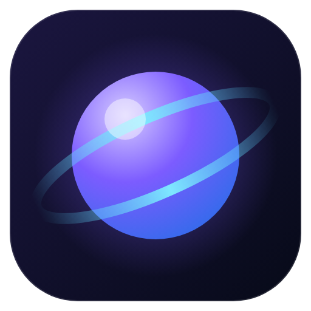

# NovaOS

**Ein komplettes „Betriebssystem“ als Overlay für Windows.**
Ein Tastendruck (`Alt + Leertaste`) legt NovaOS über deinen Bildschirm – mit eigenem
Desktop, Dock, Fenstern, Apps und Befehlspalette. Alles arbeitet mit deinem echten
System: echte Dateien, echtes Terminal, deine installierten Programme.



## Installieren (Windows)

**Variante A – fertige EXE aus GitHub Actions**

1. Auf GitHub im Repository auf **Actions → „NovaOS – Windows-Build“** gehen.
2. Den neuesten erfolgreichen Lauf öffnen und unten das Artefakt **NovaOS-Windows** herunterladen.
3. ZIP entpacken. Darin liegen:
   - `NovaOS Setup 1.0.0.exe` – Installer (mit Startmenü- und Desktop-Verknüpfung)
   - `NovaOS-1.0.0-portable.exe` – läuft ohne Installation
4. Starten. Beim ersten Mal begrüßt dich NovaOS mit einer kurzen Einführung.

> Windows SmartScreen kann warnen, weil die EXE nicht signiert ist → „Weitere Informationen“ → „Trotzdem ausführen“.

**Variante B – selbst bauen**

```powershell
# Node.js 20+ installieren: https://nodejs.org
cd nova-os
npm install
npm start            # NovaOS direkt starten
npm run dist         # Installer + portable EXE nach nova-os/dist bauen
```

## Bedienung

| Taste | Aktion |
|---|---|
| `Alt + Leertaste` | NovaOS ein-/ausblenden (in Einstellungen änderbar) |
| `Alt + Umschalt + Leertaste` | Von überall: NovaOS mit Suche öffnen |
| `Strg + K` | Befehlspalette: Apps, Programme, Dateien, Befehle, Rechnen (`=`), Websuche (`?`), Nova fragen |
| `Strg + Leertaste` | Startmenü |
| `Strg + Tab` | Fenster wechseln |
| `Alt + Q` | Fenster schließen |
| `Alt + ↑ / ↓ / ← / →` | Maximieren / Minimieren / links / rechts einrasten |
| `Alt + W` / Maus in Ecke oben links | Fensterübersicht |
| `Alt + D` | Alle Fenster minimieren |
| `Alt + T` / `Alt + E` | Terminal / Dateien |
| `Alt + 1 … 4` | Arbeitsfläche wechseln |

Das Dock zeigt rechts auch **laufende Windows-Programme** – ein Klick holt sie nach vorne.
Fenster an den Bildschirmrand ziehen rastet sie ein (Hälfte, Viertel, oben = maximieren).
Rechtsklick funktioniert überall: Desktop, Dateien, Dock, Titelleisten, Notizen …

## Apps

| App | Was sie kann |
|---|---|
| **Dateien** | Navigieren, Suchen, Kopieren/Ausschneiden/Einfügen, Drag & Drop, Umbenennen, Papierkorb, Raster/Liste, Bildvorschau, Laufwerke |
| **Terminal** | PowerShell / CMD / Bash, Tabs, Verlauf, Tab-Vervollständigung, `open .`, `edit datei` |
| **Code** | Editor mit Syntax-Highlighting, Tabs, Suchen & Ersetzen, Markdown-Vorschau, Speichern |
| **Notizen** | Markdown-Notizen als echte `.md`-Dateien in `Dokumente\NovaOS\Notizen` |
| **Aufgaben** | Listen, Fälligkeit, Priorität, wiederkehrend, Schnelleingabe („Morgen Bericht !hoch #arbeit“, „Pflanzen gießen wöchentlich“) |
| **Kalender** | Monat/Woche, Termine, Erinnerungen, deutsche Feiertage, Import/Export als .ics (Outlook, Google, Apple) |
| **Browser** | Tabs, Lesezeichen, Startseite, Zoom (echtes Chromium) |
| **Programme** | Alle installierten Windows-Programme mit Icons starten, Favoriten |
| **System** | CPU/RAM/Netzwerk live, Laufwerke, Prozesse beenden |
| **Rechner** | Standard, wissenschaftlich, Einheiten-Umrechner, Verlauf |
| **Musik** | Lokale Musik abspielen, Zufall/Wiederholen, Medientasten |
| **Bilder** | Galerie, Zoom, Drehen, Diashow, als Hintergrund setzen |
| **Fokus** | Pomodoro, Timer, Stoppuhr – mit Anzeige in der Statusleiste |
| **Wetter** | Aktuell, 24 Stunden, 7 Tage (Open-Meteo, ohne Anmeldung) |
| **Nova KI** | KI-Assistent mit Claude (eigener API-Schlüssel): Chats, Dateien als Kontext – und **handelt** für dich: „Erinnere mich morgen an …“, „Trag Freitag 14 Uhr Meeting ein“, „Was steht diese Woche an?“, „Finde meine Rechnung“. Im Editor und in Notizen: Auswahl erklären, verbessern, zusammenfassen, übersetzen |
| **Zwischenablage** | Verlauf aller kopierten Texte, Anheften |
| **Einstellungen** | Design, Akzentfarbe, Hintergründe, Durchsichtigkeit, Dock, Hotkey, Autostart |

## 3D & Effekte

- **Live-3D-Hintergründe:** *Galaxie 3D* (rotierende Spiralgalaxie, Standard), *Horizont 3D* (Flug über eine Gitterlandschaft), *Wellen 3D* (Meer aus Lichtpunkten). Sie folgen der Maus, drehen sich beim Wechsel der Arbeitsfläche mit, übernehmen die Akzentfarbe und pausieren, wenn NovaOS ausgeblendet ist oder ein maximiertes Fenster sie verdeckt
- **3D-Fenster:** öffnen sich perspektivisch, kippen beim Schließen/Minimieren weg und neigen sich beim Ziehen; der Rand leuchtet dort, wo die Maus ist
- **Strg + Tab** als 3D-Karussell, **Alt + W** mit schwebenden Fenstern, Arbeitsflächen drehen wie ein Würfel herein
- **Weltuhr 3D:** Globus mit echter Tag-/Nachtseite und Uhrzeiten
- Karten, Widgets und Symbole kippen zum Mauszeiger mit Glanzlicht, Dock-Spiegelung, Raumtiefe (Parallaxe), Plattenspieler in der Musik-App, Kalender blättert um
- Alles abschaltbar: Einstellungen → Erscheinungsbild → *Räumliche 3D-Effekte*, *Bewegter Hintergrund* oder *Leistungsmodus*

## Weitere Funktionen

- **Dock:** NovaOS-Apps und angeheftete Windows-Programme (Rechtsklick auf ein Programm → „Ans Dock heften“), Badge für fällige Aufgaben, Kalender-Symbol mit Tagesdatum, Knopf für laufende Windows-Fenster
- **Desktop:** echte Dateien deines Windows-Desktops (Drag & Drop), Widgets (einzeln wählbar), **Haftnotizen** (Rechtsklick → „Neue Haftnotiz“)
- **Statusleiste:** CPU/RAM/Netz, Fokus-Timer, **Mini-Player** während Musik läuft, Download-Fortschritt, Mitteilungen, Schnelleinstellungen
- **Fensterübersicht** (`Alt + W` oder Maus in die Ecke oben links), **4 Arbeitsflächen** (`Alt + 1…4`)
- **Dateien:** Vorschau (Bild, Text, PDF, Audio, Video), ZIP packen/entpacken, Mehrfachauswahl, Drag & Drop
- **PDF-Export** aus Notizen und Code-Editor
- **Bildschirmfoto** von Windows ohne Overlay (Schnelleinstellungen oder Befehlspalette)
- **Sicherung & Wiederherstellung** aller NovaOS-Daten (Einstellungen → System)
- **Leistungsmodus** für ältere PCs, helles/dunkles/automatisches Design, 8 Akzentfarben, eigene Hintergrundbilder, Durchsichtigkeit

## Datenschutz

Alles bleibt auf deinem PC: Einstellungen in `%APPDATA%\NovaOS`, Notizen als Dateien in `Dokumente\NovaOS`.
Ins Internet geht nur, was du selbst auslöst: Webseiten im Browser, Wetter (Open-Meteo, nur der gewählte Ort) und – falls eingerichtet – Nova KI (deine Nachrichten an die Claude-API; der Schlüssel wird mit Windows-Verschlüsselung gespeichert).

## Entwicklung

```bash
npm run preview   # Oberfläche im Browser (simuliertes System) → http://localhost:5173
npm run check     # Syntax-Prüfung aller Dateien
npm run test:unit # Unit-Tests (Rechner, Markdown, ANSI, Pfade …)
npm test          # alles inkl. 37 Oberflächen-Tests (Playwright)
npm run dev       # Electron mit Entwicklertools
```

Aufbau und Arbeitsweise: siehe [PLAN.md](PLAN.md).
